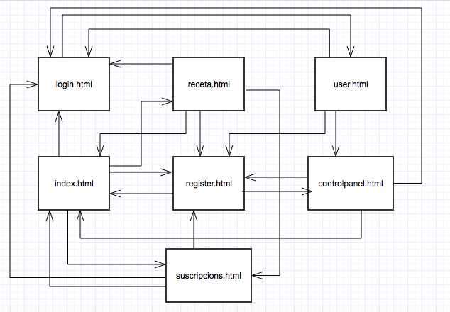
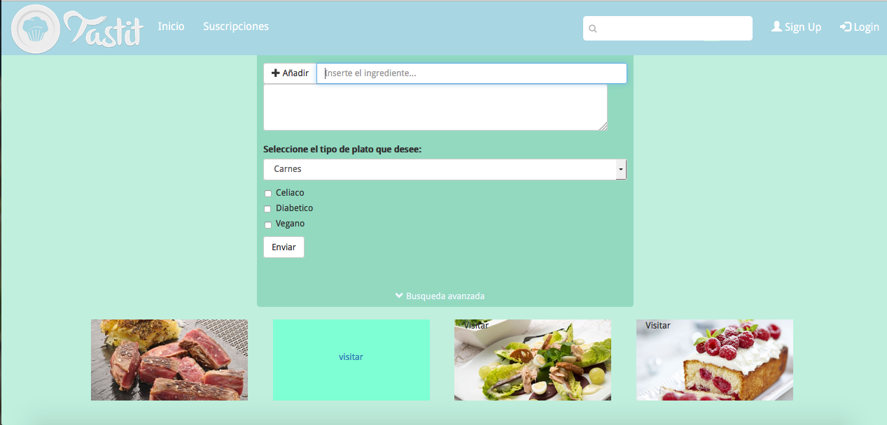
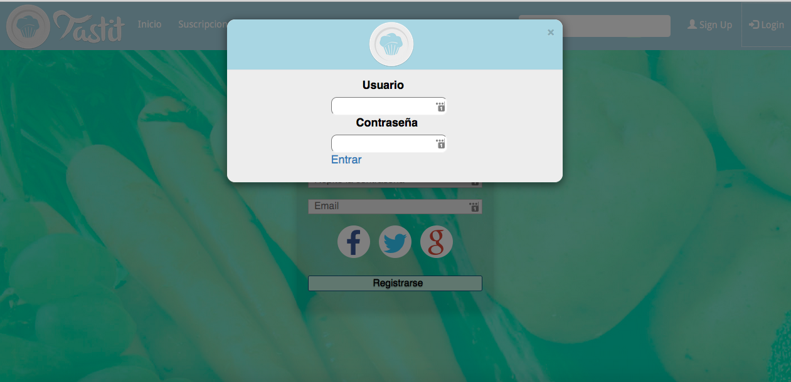
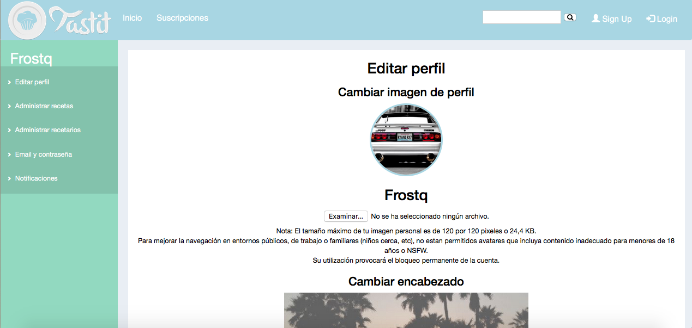
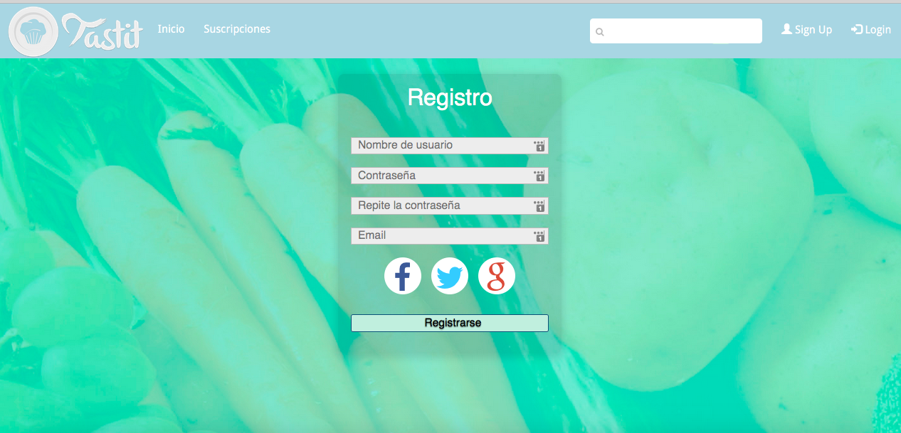
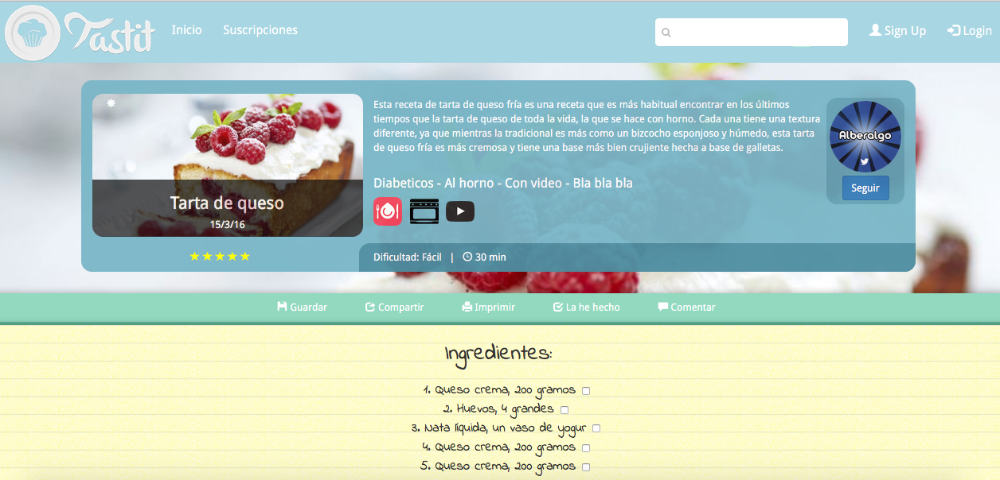
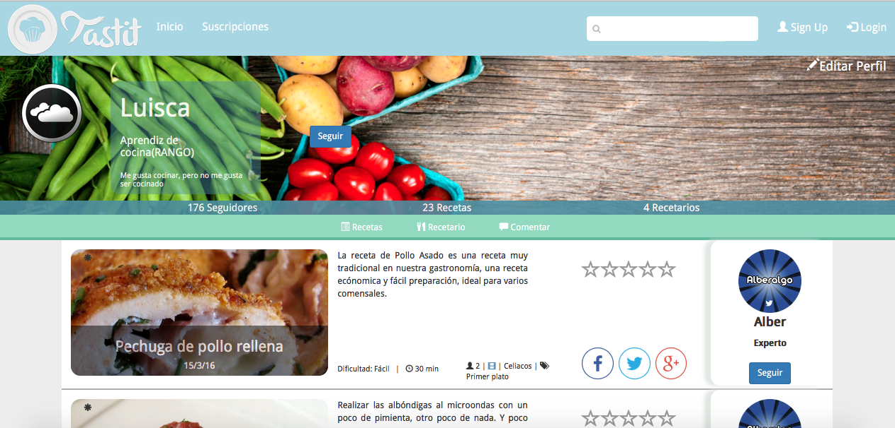
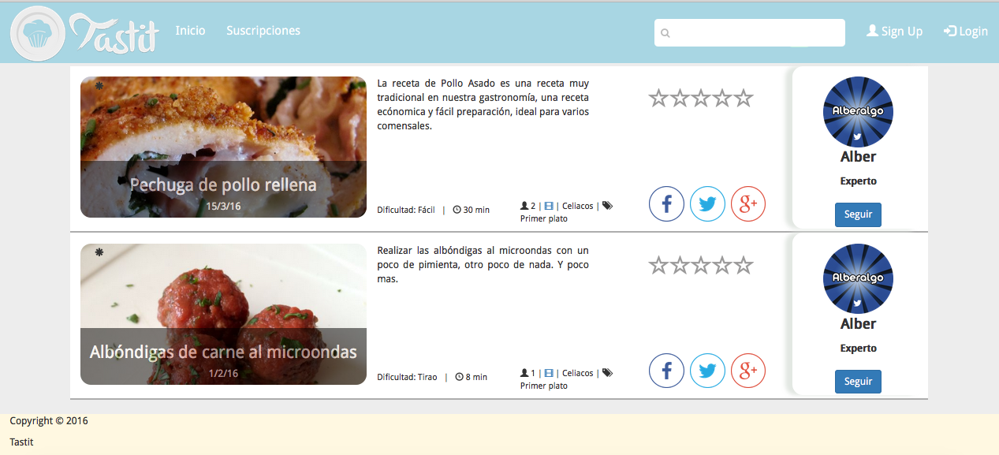

## Nombre de la aplicación: 
 TASTIT.

## Descripción: 
 Una web donde puedes subir tus propias recetas y ver las de los demas. Puedes filtrar recetas por ingredientes o etiquetas. Al crear la receta, puedes indicar que la receta sea publica o privada. En la parte privada, el usuario puede ver todas sus recetas y las valoraciones / comentarios en sus recetas.

## Entidades:
- Receta: Cada receta cuenta con el titulo, el usuario que la ha creado, el cuerpo de la receta, fecha de creacion, etiquetas.
- Usuarios: Cada usuario cuenta con su nick, contraseña, fecha de creación, recetas, y imagen de perfil.
- Valoracion: Estrellas, nº veces compartido, comentarios.
- Técnica: Técnicas usadas para la elaboración de la receta.
- Ingrediente: Nombre, descricion, imagen del ingrediente, recetas en las que se usan.

## Diagrama de navegación entre todas las páginas diseñadas:

 

## Captura de pantalla de las páginas principales:

## Integrantes del equipo de desarrollo: 
- Diego López: 
d.lopezgarc@alumnos.urjc.es  https://github.com/Frostqui

- Luis Carlos Jimenez:
 lc.jimenezl@alumnos.urjc.es  https://github.com/luiscajl

- Alberto Álvarez:
a.alvarezgom@alumnos.urjc.es	 https://github.com/alberalgo

## Enlace a Trello: 
 https://trello.com/b/iwkta2c2/daw

##Ingenieria del software, 3 Curso
 
